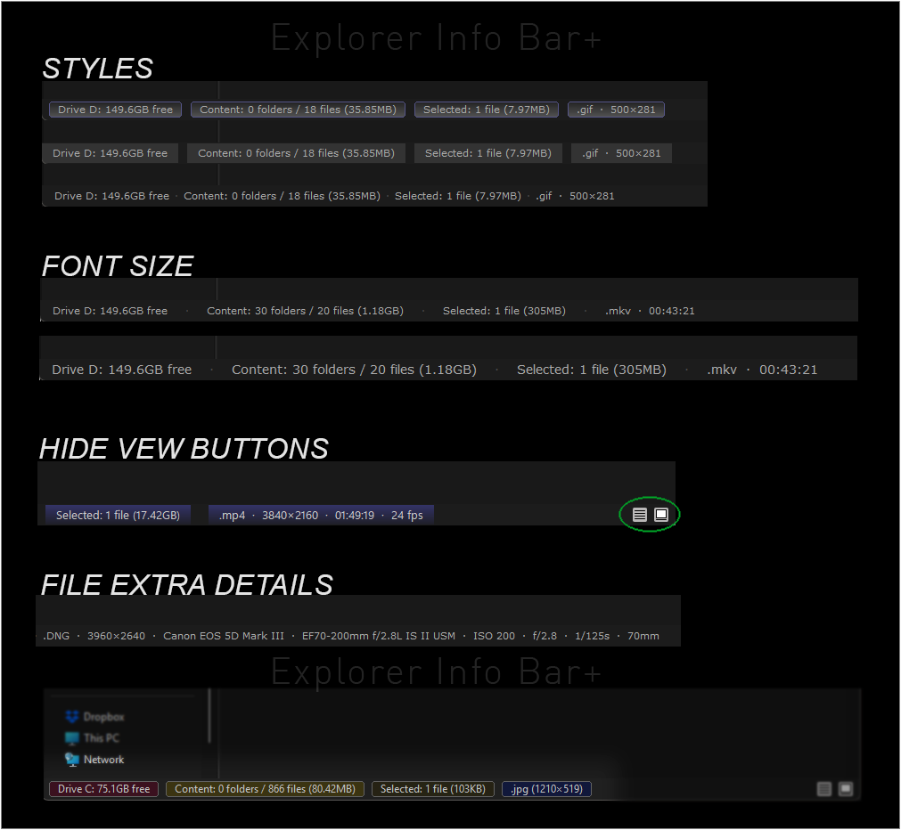

Explorer Info Bar+

Current release: 1.2.0

Explorer Info Bar+ enhances File Explorer's native Windows 11 bottom info bar with useful drive, folder, selection, and single-file details while keeping the information compact and highly configurable.

What's new in 1.2

-Expanded single-file details for photos, RAW files, video, audio, and other file types

-Standard and Extended detail levels so you can control how much metadata is shown

-Photo/RAW metadata including camera, lens, ISO, aperture, shutter speed, and focal length when available

-Video and audio details including duration, resolution, frame rate, sample rate, and channels when available

-Font family and font size controls

-Adjustable left padding and spacing between sections

-Solid or four-direction gradient fills for Flat panes and Soft cards

-Automatic theme-derived colors or fully custom text and panel colors

-Optional hiding of Explorer's native bottom-right view buttons

Features:
-Drive free-space information
-Current folder summary
-Folder count
-File count
-Immediate file-size total
-Selection summary
-Selected folders
-Selected files
-Selected file size
-Single-file details when available
-Literal file extension
-Photo and RAW dimensions, camera, and lens information
-Optional ISO, aperture, shutter speed, and focal length
-Video resolution and media duration
-Optional video frame rate, audio sample rate, and channel count
-Optional Windows file type and modified date/time for other files
-Configurable detail levels so you can choose how much metadata is shown

-Three display styles
*Simple
*Flat panes
*Soft cards

-Solid or four-direction gradient fills for Flat panes and Soft cards
-Configurable section order and visibility
-Configurable font family and font size
-Configurable left padding and spacing between sections
-Automatic theme-derived colors or custom text and panel colors
-Optional hiding of Explorer's native bottom-right view buttons
-File detail levels

-Photo Details
*Off — No photo metadata
*Standard — Extension, resolution, camera, and lens when available
*Extended — Standard + ISO, aperture, shutter speed, and focal length when available

-Video / Audio Details
*Off — No media metadata
*Standard — Extension, video resolution, and duration when available
*Extended — Standard + frame rate, audio sample rate, and channels when available

-Other Details
*Off — No extra file details
*Basic — Extension
*Extended — Extension, Windows file type, and modified date/time

Metadata availability depends on the file format and the Windows property/codec handlers installed on the system. Missing fields are simply omitted.

Customization:
-Choose between Simple, Flat panes, and Soft cards
-Use solid panel fills or gradients in four directions
-Use automatic Explorer-derived colors or custom text and panel colors
-Change the font family and font size
-Adjust the left-edge padding and spacing between sections
-Reorder or hide Drive, Content, and Selected sections
-Control how much single-file metadata is shown
-Hide Explorer's native bottom-right view buttons for a cleaner info bar

Panel fills:
-Solid
-Left to Right
-Right to Left
-Top to Bottom
-Bottom to Top

Gradient fills use the existing panel color and fade toward Explorer's status-row background, so no additional gradient color settings are required.

Examples:

Drive D: 150.7GB free
Content: 15 folders / 25 files (77.2MB)
Selected: 2 folders / 4 files (571KB)

Photo:
.jpg  ·  4032×3024  ·  Nikon Z8  ·  NIKKOR Z 24-70mm f/2.8 S

RAW:
.cr3  ·  4498×6742  ·  EOS R  ·  ISO 400  ·  f/1.4  ·  1/125s  ·  85mm

Video:
.mp4  ·  3840×2160  ·  01:49:19  ·  24 fps

Audio:
.mp3  ·  00:03:47  ·  44.1 kHz  ·  Stereo

Compatibility

Explorer Info Bar+ uses the native Windows 11 bottom status area; it does not restore or create a classic msctls_statusbar32 status bar.

Do not enable Classic Explorer Status Bar or PreVista Explorer Status Bar at the same time as Explorer Info Bar+. They try to control the same bottom Explorer area and can conflict or overlap.

Explorer Info Bar+ paints over the native status-row text, including output from Explorer Status Bar Metadata. Do not enable Explorer Status Bar Metadata at the same time because its output will be covered.

License

GPL-3.0-only